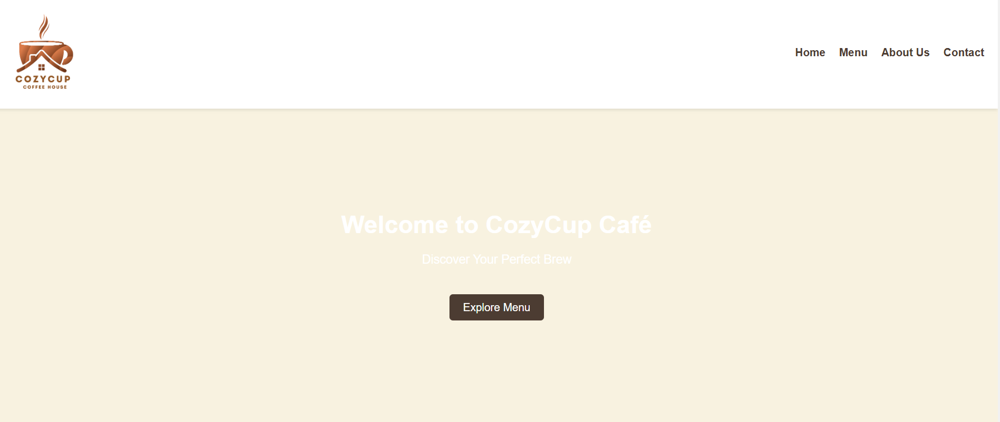
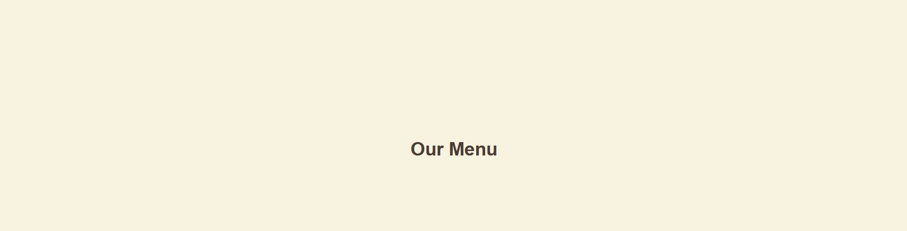
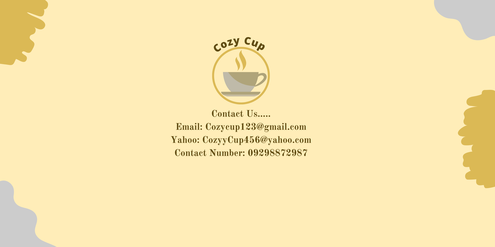

# Cozy Cup Cafe

## Project Description
A simple and responsive website for Cozy Cup Cafe that showcases the menu, cafe background, and contact details for customers.

## Features
- Interactive navigation header
- Home banner with featured content
- Product menu layout
- About Us section highlighting the cafe's story
- Contact section with details and locations

## Screen Captures

### Home

This is the homepage of the Cozy Cup Cafe website.

### Menu

This section displays the drinks and food offered by the cafe.

### About Us

This section introduces the Cozy Cup Cafe and its story.

### Contact

This section provides the contact information of the cafe.

## About the Authors

<table>
  <tr>
    <td align="center">
       
      <b>Kaiser Mamansag</b> 
      <a href="mailto:mamansagkaiser@gmail.com">mamansagkaiser@gmail.com</a> 
      <a href="https://github.com/ShituzieKai">GitHub</a>
    </td>
    <td align="center">
       
      <b>Renz Bacongallo</b> 
      <a href="mailto:renzbacongallo31@gmail.com">renzbacongallo31@gmail.com</a> 
      <a href="https://github.com/Renz-202480288">GitHub</a>
    </td>
  </tr>
</table>
